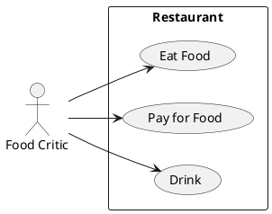

# Описание требований и архитектуры

## Введение
<!-- Общее краткое описание создаваемой системы -->
В рамках курса осуществляется проектирование решения на основе [постановки задачи от "заказчика"](../../task.md).

- [Описание требований и архитектуры](#описание-требований-и-архитектуры)
  - [Введение](#введение)
  - [Заинтересованные стороны](#заинтересованные-стороны)
  - [Бизнес-контекст (бизнес-требования)](#бизнес-контекст-бизнес-требования)
  - [Глоссарий](#глоссарий)
  - [Модель предметной области](#модель-предметной-области)
  - [Требования к системе](#требования-к-системе)
    - [Сценарии использования (Use case)](#сценарии-использования-use-case)
    - [Функциональные требования](#функциональные-требования)
    - [Бизнес-метрики](#бизнес-метрики)
    - [Нефункциональные требования/Требования к атрибутам качества](#нефункциональные-требованиятребования-к-атрибутам-качества)
    - [Алгоритмы мониторинга атрибутов качества](#алгоритмы-мониторинга-атрибутов-качества)
    - [Ограничения](#ограничения)
  - [Архитектура](#архитектура)
    - [Журнал архитектурных решений](#журнал-архитектурных-решений)
    - [Контекст решения](#контекст-решения)
    - [Компонентная архитектура](#компонентная-архитектура)
    - [Реализация сценариев использования](#реализация-сценариев-использования)
    - [Программные интерфейсы](#программные-интерфейсы)
    - [Схема развертывания](#схема-развертывания)
  
## Заинтересованные стороны
<!-- Перечень заинтересованных сторон и их интересов по отношению к создаваемой системе. 
Подробнее: https://confluence.mts.ru/pages/viewpage.action?pageId=399975538 
-->
| Заинтересованная сторона         | Интересы                                                                                                        |
|:---------------------------------|:----------------------------------------------------------------------------------------------------------------|
| Организаторы конференции         | Эффективный отбор и оценка докладов, оптимизация  работы с докладчиками, создание распиания мероприятия         |
| Докладчики                       | Оперативная связь и рецуензирвоание докладов, возможно взаимодействия с аудиторией и получения отзывов          |
| Зрители (участники конференции)  | Удобное распиание, возможность задавать вопросы, возможность просмотра записи докладов по окончании конференции |

## Бизнес-контекст (бизнес-требования)
<!-- Общее описание бизнес-контекста создаваемой системы (автоматизируемой деятельности), список бизнес-целей заинтересованных сторон 
Подробнее: https://confluence.mts.ru/pages/viewpage.action?pageId=399973845
-->
- Отбор и оценка докладов: приложение предоставляет возможности просматривать, оценивать, а так же отслеживать статус доклада организаторами 
- Процесс подачи докладов: приложение должно предоставлять удобный интерфейс докладчикам для упрощения подачи докладов и иной контекстной информации
- Создание и управление расписанием: инструмент для составления, редактирования и публикации расписания конференции, предоставляемый приложением. Должен учитывать время, место, формат докладов
- Возможность удаленного участия: приложение должно поддерживать интеграцию с популярными платформами для видеоконференций, чтобы предоставить возможность участия зрителям, которые не могут посетить конференцию лично
- Конфиденциальность данных: приложение должно обеспечивать защиту личных данных всех участников конференции, а так же предотвращать несанкционированный доступ к докладам и рецензиям.

## Глоссарий
<!-- Содержит основные понятия и термины предметной области  
Подробнее: https://confluence.mts.ru/pages/viewpage.action?pageId=375782595
-->
| Понятие                   | Сокращение    | Определение                       |
|:--------------------------|:--------------|:----------------------------------|
| Докладчик (Speaker)       |               | Лицо, предоставляющее доклад на конференцию. Имеет имя и контактную информацию 
| Доклад (Presentation)     |               | Информация, предоставляемая докладчиком на конференции. Имеет заголовок, содержание, файл презентации и статус (принят/в обработке/отклонен).
| Рецензент (Reviewer)      |               | Эксперт, оценивающий доклады. Имеет имя, контактную информацию и область экспертизы
| Рецензия (Review)         |               | Оценка и коментарии рецензента относительно предложенного доклада. Содержит рейтинг, коментарии и рекомендации
| Сессия (Session)          |               | Отдельное мероприятие на конференции, состоящее из одного или нескольких докладов в одной тематике. Имеет дату, время начала, продолжительность и список докладов
| Трек (Track)              |               | Набор из сессий, связанных одной тематикой. Трек имеет название, описание и список сессий
| Расписание (Schedule)     |               | Расписание конференции, показывающее как сесси и треки организованы во времени в конференции. Включает дату, список потоков и сессиий
| Трансляция (Broadcast)    |               | Онлайн-трансляция конференции. Имеет URL-адрес, статус (ожидание, активная, завершенная) и определенный доклад
| Обратная связь (Feedback) |               | Отзыв участников конференции о докладе. Содержит рейтинг, комментарии, связанный доклад и участника, автора обратной связи
| Участник (Participant)    |               | Зритель на конференции, участник на определенных мероприятиях. Имеет имя, контактную информацию, данные о регистрации

## [Модель предметной области](data/data.md)

## Требования к системе

### Сценарии использования (Use case)
<!-- Подробное описание сценариев использования системы с привязкой к ролям участников и задействованным бизнес-сущностям 
https://confluence.mts.ru/pages/viewpage.action?pageId=375782108 
https://confluence.mts.ru/pages/viewpage.action?pageId=375782119 
-->
#### Диаграмма сценариев использования (Use Case Diagram) <!-- omit in toc -->

#### Список сценариев использования <!-- omit in toc -->

| ID     | Описание                                          |
|--------|---------------------------------------------------|
| UC.001 | *[Название сценария использования](uc/uc.001.md)* |

### Функциональные требования
<!-- Описание требований к функциям, реализуемым системой. Требование может быть привязано к сценарию использования или быть общим 
Подробнее: https://confluence.mts.ru/pages/viewpage.action?pageId=375782501 
-->
| ID     | Функциональное требование                                                                                                                                                                 |
|--------|-------------------------------------------------------------------------------------------------------------------------------------------------------------------------------------------|
| FR.001 | Система должна предоставлять интерфейс для создания аккаунта участника, а так же сохранять данные в базе данных                                                                           |
| FR.002 | Система должна реализовать процесс аутентификации пользователей с использованием учетных данных (электроная почта и/или логин + пароль)                                                   |
| FR.003 | Система должна предоставлять возможность докладчику подать заявку на доклад, включая загрузку файла, ввод краткого описания и контактной информации докладчика                            |
| FR.004 | Система должна предоставлять организаторам функционал по рецензированию, оценке и управлению докладами, так же может предоставлять инструменты для отправки обратной связи                |
| FR.005 | Система должна предоставялть функционал для управления распианием, с учетом времени, места, и формата докладов                                                                            |
| FR.006 | Система должна интегрироваться с популярными платформами для трансляций, обеспичивать качественное вещание в прямом эфире, высокое качество записанного материала для просмотра "оффлайн" |
| FR.007 | Система должна предоставлять инструменты взаимодействия с аудиторией (ответы на вопросы, отзывы на доклады)                                                                               |

### Бизнес-метрики 
- 90% заявок на доклад обрабатываются в течение 7 дней
- 100 докладчиков на конференции
- Возможность просмотра докладов в записи в течении месяца после окончания конференции
- Зритель получит уведомление о проведении доклада за 3 часа
- 70% зрителей оставили обратную связь о докладе

### Нефункциональные требования/Показатели качества
| Нефункциональное требование                                                           | Показатель качества                                                                                                                                            |
|---------------------------------------------------------------------------------------|----------------------------------------------------------------------------------------------------------------------------------------------------------------|
| Время рецензирования доклада не более 3 дней                                          | Время рецензии одного доклада - 3 дня, при максимальном количестве докладов, находящихся в системе рецензирования - 30                                         |
| Максимальное количество докладчиков на конференции - 100                              | Максимальное количество уникальных записей в бд, отвечающей за хранение данных о докладчиках - 100, к моменту окончания сбора заявок на выступление с докладом |
| Обеспечение необходимого места для хранения всех записей докладов (200гб+)            | Объем свободного места в хранилище не должен быть меньше 10% при условии, что каждый доклад хранится 1 месяц и его размер не превышает 2гб                     |
| Окно отправки уведомления о начале доклада через 3 часа не более двух минут           | Количество записей в бд, отражающих отправленные уведомления, равное количеству докладов, которые будут проведены через 178 минут                              |
| 100% Зрителей доклада получили форму для обратной связи сразу после окончания доклада | Количество отправленных форм для обратной связи равное количеству зарегистрированных зрителей для каждого доклада                                              |

### Описание атрибутов качества
<!-- Требования к основным архитектурным характеристикам (атрибутам качества) системы - надежность, масштабируемость, ИБ, и др.
Подробнее: https://confluence.mts.ru/pages/viewpage.action?pageId=375782530
-->
| ID     | Атрибут качества             | Описание требования                                                                                                                                                                                                                                                                                   |
|--------|------------------------------|-------------------------------------------------------------------------------------------------------------------------------------------------------------------------------------------------------------------------------------------------------------------------------------------------------|
| QR.001 | Доступность                  | Определяет, какую часть времени система функциональна и работает. Доступность может быть измерена как процентное соотношение времени простоя системы за заданный промежуток времени. На доступность оказывают влияние ошибки системы, проблемы инфраструктуры, злонамеренные атаки и нагрузка системы |
| QR.002 | Надежность                   | Способность системы сохранять работоспособность в течение некоторого времени. Надежность определяется как вероятность того, что система сможет выполнять предусмотренные функции в течение заданного промежутка времени                                                                               |
| QR.003 | Производительность           | Характеризует скорость, с какой система выполняет любое действие в заданный промежуток времени                                                                                                                                                                                                        |
| QR.004 | Информационная безопасность  | Способность системы предотвращать злонамеренные или случайные действия, не предусмотренные при проектировании, или не допускать разглашение или утрату данных. Безопасная система должна защищать ресурсы и предотвращать несанкционированные изменения данных                                        |
| QR.005 | Удобство использования       | Определяет, насколько приложение соответствует требованиям пользователя и потребителя с точки зрения понятности, простоты локализации и глобализации, удобства доступа для пользователей с физическими недостатками и обеспечения хорошего взаимодействия с пользователем в общем                     |

### Алгоритмы мониторинга атрибутов качества
| Атрибут качества            | Алгоритм мониторинга                                                                                                                                                                                                   |
|-----------------------------|------------------------------------------------------------------------------------------------------------------------------------------------------------------------------------------------------------------------|
| Доступность                 | Использования системы мониторинга, такой как Prometheus, для неприрывного отслеживания доступности системы и оповещения о возможных проблемах                                                                          |
| Надежность                  | Отслеживание времени безоткажной работы с помощью журнала событий. Анализ сбоев и их причин, чтобы выявить сбои и их причины и предотвратить проблемы в будущем                                                        |
| Производительность          | Использование APM (Application Perfomance Monitoring) инструментов для наблюдения за производительностью системы в реальном времени и для устранения узких мест                                                        |
| Информационная безопасность | Регулярное проведение автоматизированных сканирований безопасности, таких как сканирование уязвимостей и статический анализ кода, с использованием инструментов, таких как SonarQube                                   |
| Удобство использования      | Проведение опросов удовлетворенности пользователей и анализ полученных данных для определения уровня удовлетворенности и выявления возможных проблем в пользовательском интерфейсе или опыте взаимодействия с системой |

### Ограничения
<!-- Описываются ограничения, оказывающие влияние на архитектуру системы - временные, финансовые, технологические
Подробнее: https://confluence.mts.ru/pages/viewpage.action?pageId=375782592
-->
| ID     | Ограничение                                                                                                                                                                                            |
|--------|--------------------------------------------------------------------------------------------------------------------------------------------------------------------------------------------------------|
| AC.001 | Замедление времени отклика системы может привести к дополнительным задержкам в отправке уведомлений о начале докладов                                                                                  |
| AC.002 | Увеличение затрат на оборудование и инфраструктуру для поддержания гарантий ACID и обработки большого количества данных (например, хранение докладов и отправка уведомлений)                           |
| AC.003 | Увеличение нагрузки на сервера баз данных для обеспечения строгих гарантий консистентности может сказаться на производительности системы при больших объемах данных                                    |
| AC.004 | Ограниченная горизонтальная масштабируемость системы может затруднить увеличение количества докладчиков, зрителей и обработку большого количества заявок на доклад (для возможных будущих конференций) |

## Архитектура

### Журнал архитектурных решений
<!-- Записи о ключевых принятых архитектурных решениях (ADR) для реализации архитектурно-значимых требований.
Подробнее: https://confluence.mts.ru/pages/viewpage.action?pageId=421162308
-->
- [ADR.NNN Суть решения](adr/adr-template.md)

### [Контекст решения](context/context.md)

### [Компонентная архитектура](components/components.md)

### Реализация сценариев использования
<!-- Реализация сценариев использования на основе взаимодействия компонентов системы и внешних систем/участников.
Диаграммы последовательности (UML Sequence diagram) и текстовое описание.

Подробнее: 
https://confluence.mts.ru/pages/viewpage.action?pageId=399442132
https://confluence.mts.ru/pages/viewpage.action?pageId=399442170
-->
| ID     | Описание                          | Реализация                                    |
|--------|-----------------------------------|-----------------------------------------------|
| UC.001 | *Название сценария использования* | [Реализация сценария](uc-impl/uc.001-impl.md) |

### Программные интерфейсы
<!-- Спецификации публичных API системы и ее компонентов (синхронных, событийных). Создается на основе модели предметной области для реализации сценариев использования. 
  Форматы: OAS/Swagger, GraphQL, AsyncAPI/CloudEvents
-->
| Компонент             | Интерфейс                                      |
|:----------------------|:-----------------------------------------------|
| *Название компонента* | *[Название интерфейса](api/service-name.yaml)* |

### [Схема развертывания](deployment/deployment.md)
